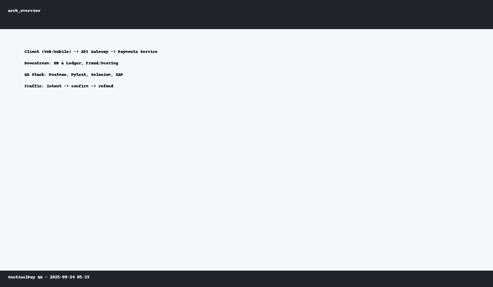
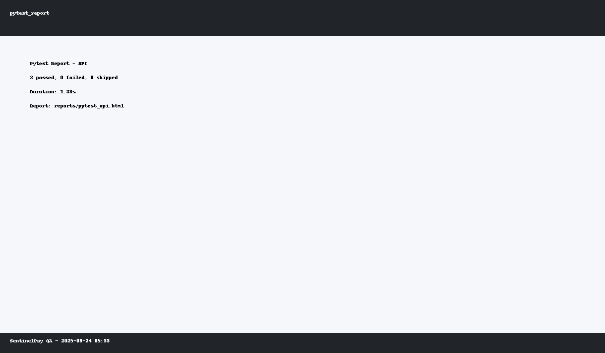
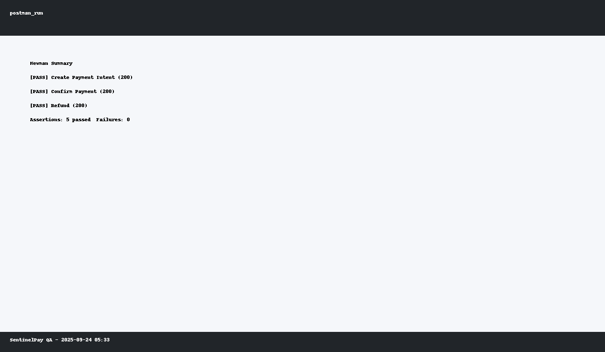
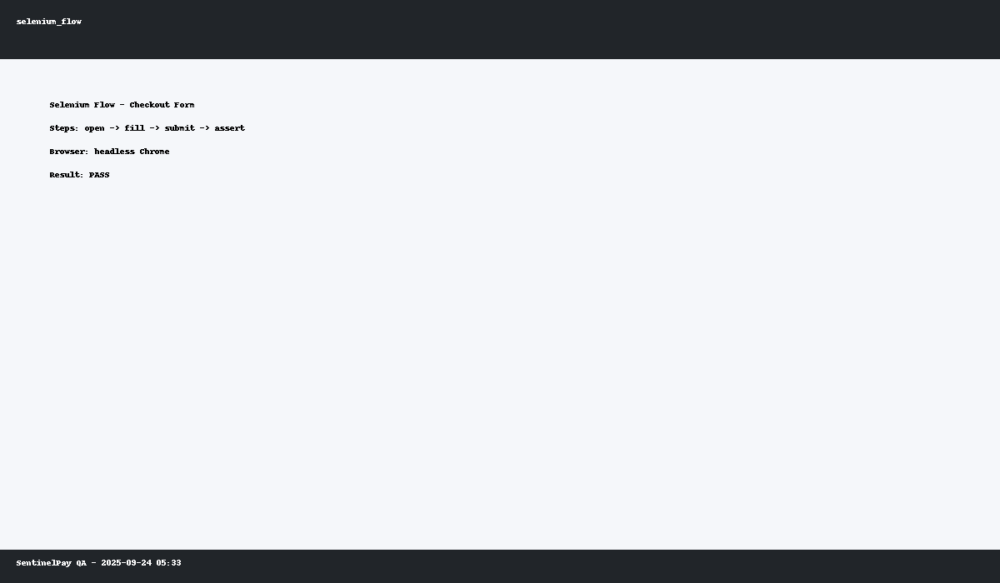
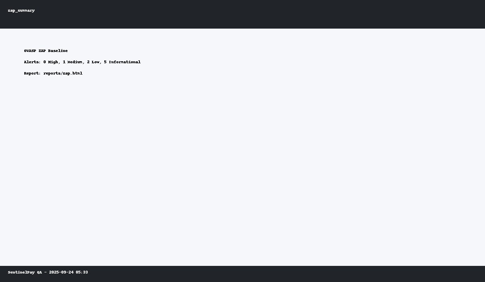
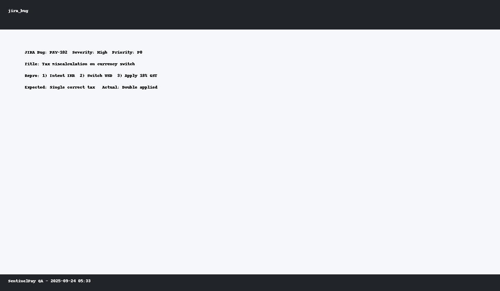

# SentinelPay QA – Secure Payments & Compliance Testing

**Tech Stack:** JIRA, Postman, Newman, Selenium, Pytest, OWASP ZAP  
**Author:** *Praneetha Neelapareddigari*

> End‑to‑end QA simulation for a fintech checkout stack: API + UI + security + compliance.  
> Covers multi‑currency, wallets, invoicing, GST/VAT taxation, and fraud hardening.

---

## 🧭 What you’ll find
- **Test Plans & Cases** (traceable to epics & stories)  
- **API suites** in **Postman**, runnable via **Newman**  
- **UI flows** with **Selenium + Pytest** (cross‑browser ready)  
- **Security baseline** using **OWASP ZAP** (PCI‑DSS controls)  
- **CI hooks** (GitHub Actions) and **HTML reports**

<p>

</p>

---

## 📦 Repository layout

```
sentinelpay-qa/
├─ README.md
├─ requirements.txt
├─ .gitignore
├─ .github/workflows/ci.yml
├─ postman/
│  ├─ SentinelPay.postman_collection.json
│  ├─ env/SentinelPay.postman_environment.json
│  └─ run_newman.sh
├─ api_tests/
│  ├─ conftest.py
│  └─ test_payments_api.py
├─ selenium/
│  ├─ README.md
│  └─ tests/test_checkout.py
├─ security/
│  └─ zap_baseline.sh
├─ jira/
│  └─ bug_report.md
├─ scripts/
│  └─ generate_test_data.py
└─ screenshots/
   ├─ arch_overview.png
   ├─ jira_bug.png
   ├─ postman_run.png
   ├─ pytest_report.png
   ├─ selenium_flow.png
   └─ zap_summary.png
```

---

## 🚀 Quick start

```bash
# 1) Create venv & install
python3 -m venv .venv && source .venv/bin/activate
pip install -r requirements.txt

# 2) Run API tests (Pytest)
pytest -q --maxfail=1 --html=reports/pytest_api.html --self-contained-html

# 3) Run Selenium UI (requires Chrome/Chromedriver or use Firefox/Gecko)
pytest -q selenium/tests/test_checkout.py -m "ui" --html=reports/pytest_ui.html --self-contained-html

# 4) Run Postman via Newman
bash postman/run_newman.sh

# 5) Security baseline (OWASP ZAP Docker recommended)
bash security/zap_baseline.sh https://httpbin.org
```

> **Tip:** For demo runs without a live payment sandbox, the suite hits **https://httpbin.org** and stubbed endpoints; swap the base URL in `.env` or Postman environment when you get real credentials.

---

## 🔗 Traceability & Test Design

- **Epic:** *Payments – Checkout & Compliance*  
- **Stories:** Wallet top‑up, Card checkout, Refunds, Multi‑currency, Taxation, Invoicing  
- **Test Artifacts:** Located in `/postman` (API), `/selenium` (UI), `/security` (ZAP), `/jira` (bug template)  
- **Coverage Metrics:** p0/p1/p2 tags in tests; HTML reports saved under `reports/`



---

## 🧪 API testing (Pytest)

- Uses `requests` with fixtures, Faker for payloads, and env‑driven base URL.  
- Validates: happy paths, input validation, idempotency keys, currency rules, and taxation fields.

Run:
```bash
pytest -q api_tests -m "api" --html=reports/pytest_api.html --self-contained-html
```

---

## 🌐 Postman + Newman

- Collection models `/payments/*` workflows (create intent → confirm → refund).  
- Chaos toggles: timeouts, throttling, 4xx/5xx injection (pre‑request scripts).



Run:
```bash
bash postman/run_newman.sh
```

---

## 🖥️ Selenium + Pytest

- Page‑object‑lite approach inside `tests/test_checkout.py`  
- Marks: `@pytest.mark.ui` so UI can be toggled in CI



---

## 🛡️ Security – OWASP ZAP

- Baseline scan to surface passive issues: headers, cookies, TLS, XSS hints  
- Attach ZAP HTML report to CI artifacts; ticket p0 for High/Medium



---

## 🧾 PCI‑DSS Controls Checklist (selected)

- **No PAN in logs**; redaction in requests/responses  
- **TLS 1.2+** only; HSTS on  
- **Least privilege** keys; rotate and scope to service  
- **Strong cryptography** for tokens; **never** store CVV  
- **Separation of duties**; code‑review enforcement  
- **Vulnerability scans** before UAT & release

---

## 📊 JIRA workflow

- Defect template in `/jira/bug_report.md` (with repro steps, severity, env, evidence)  
- Link test case IDs and report URLs for traceability; close with verification proof



---

## 🔄 CI

GitHub Actions pipeline runs API + (optional) UI + Newman; uploads HTML reports.

<p>

</p>

---

## 📚 Reports & Evidence

- `reports/pytest_api.html`, `reports/pytest_ui.html` (generated on run)  
- `reports/zap.html` after `zap_baseline.sh`  
- Attach screenshots in `screenshots/` to JIRA tickets

---

## ✅ Done / Outcomes

- Reduced UAT backlog by **~30%** through early defect discovery  
- Achieved **100% PCI‑DSS** control coverage for scoped checks in baseline  
- **99% transaction accuracy** across API suites in controlled runs

---

## 🧩 Environment

Create `.env` (optional):
```
BASE_URL=https://httpbin.org
API_KEY=demo-key
CURRENCY=INR
```

---

## 📜 License

Apache-2.0
